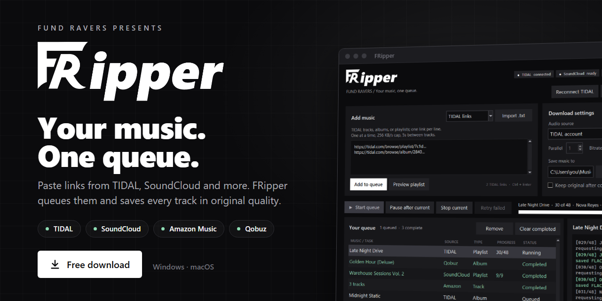
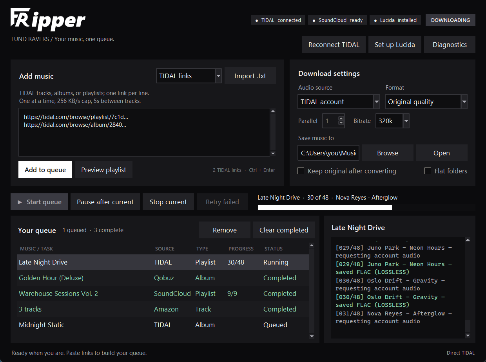
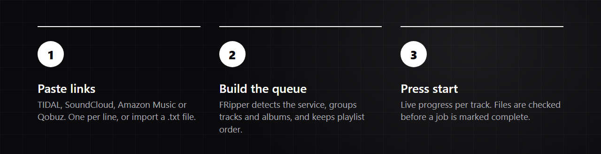
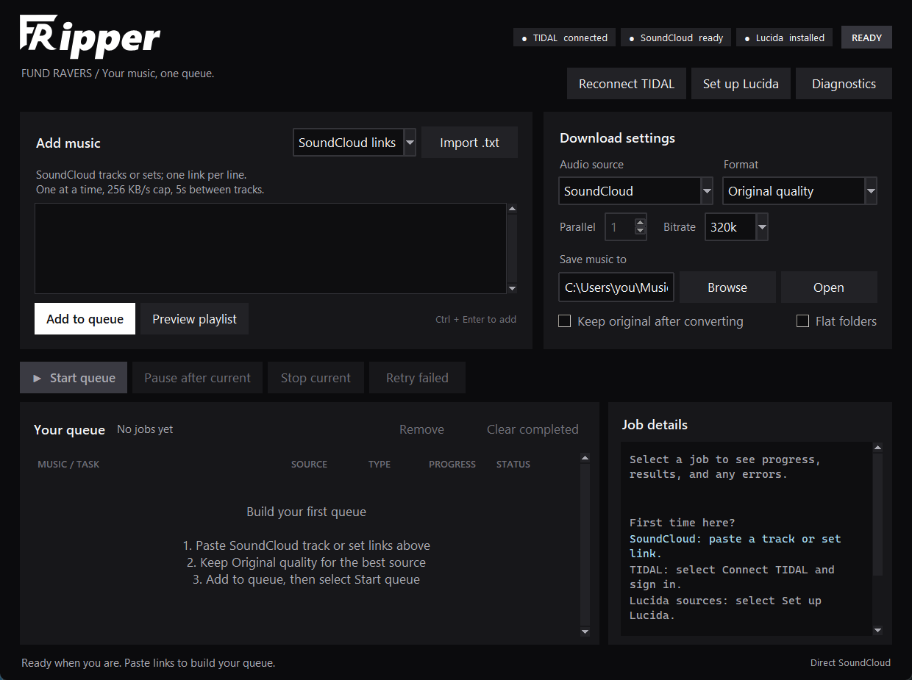
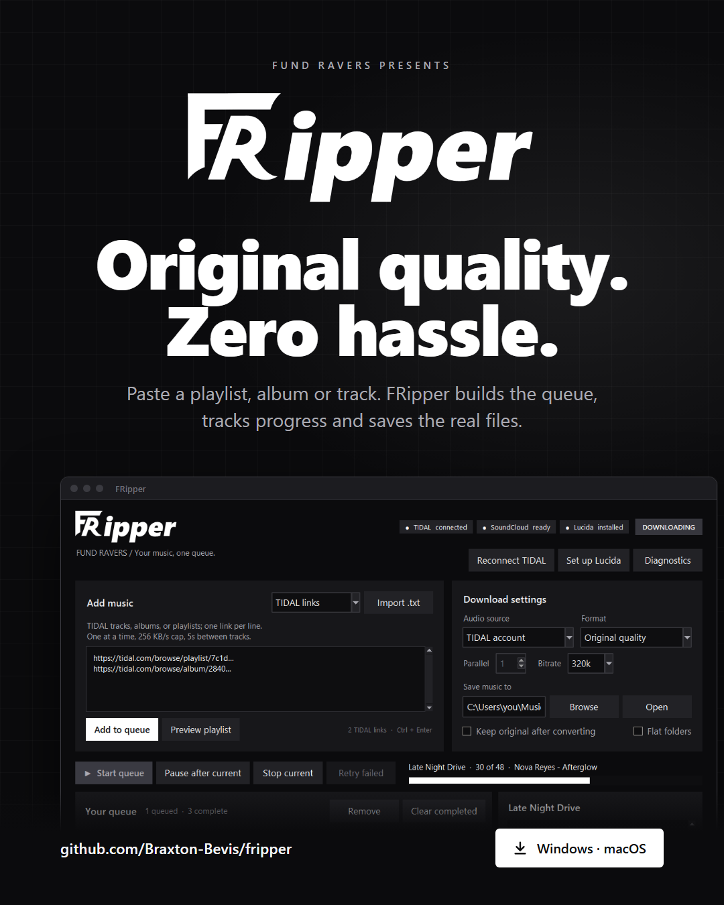
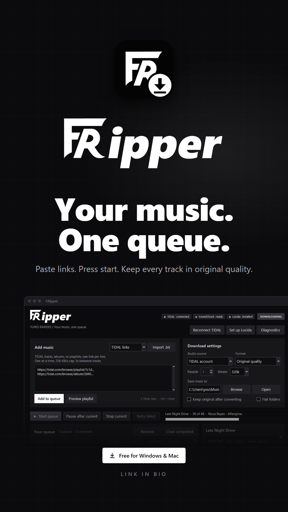
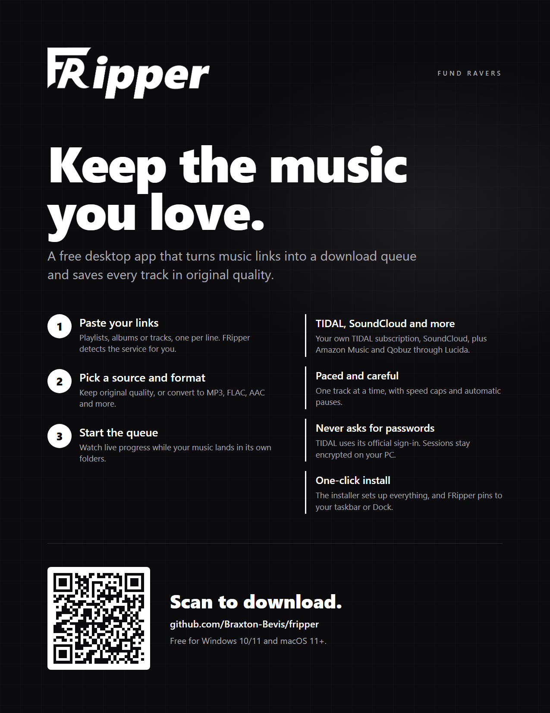
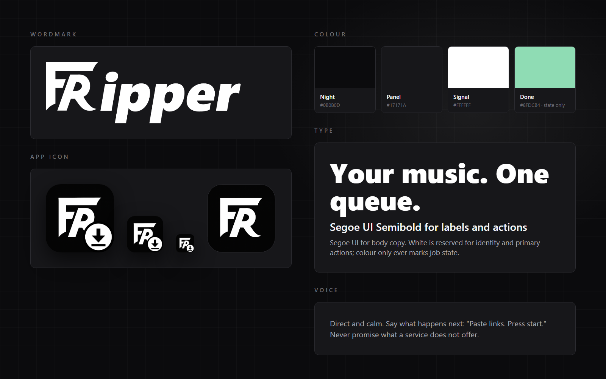

  

  
  
  
  

**FRipper** is a desktop app for saving music you have access to. Paste TIDAL, SoundCloud or other music links, build a queue, and download every track in its original quality.

## How it works

- **Paste anything:** playlists, albums or single tracks, one per line, or import a `.txt` file. FRipper detects TIDAL and SoundCloud links and picks the right mode.
- **Original quality by default:** source files are kept untouched. You can also convert to MP3, FLAC, AAC, Opus, OGG or WAV.
- **Live progress:** track-by-track progress, colour-coded status, and full job logs. Files are checked before a job is marked complete.
- **Paced and careful:** one TIDAL or SoundCloud transfer at a time, with a speed cap and a pause between tracks. Rate limits pause the queue automatically.
- **Private by design:** FRipper never asks for a password. TIDAL uses its official device sign-in, and sessions are encrypted with Windows' per-user protection.

## Install

1. Download **[FRipper.zip](../../releases/latest/download/FRipper.zip)**, then unzip it.
2. Run the installer for your computer:

| Computer | Run this | First-time note |
| --- | --- | --- |
| Windows 10/11 | `Install FRipper (Windows).cmd` | If SmartScreen appears, choose **More info → Run anyway**. |
| macOS 11+ | `Install FRipper (Mac).command` | Right-click it and choose **Open** (double-click is blocked the first time). Enter your Mac password if it asks to install Python. |

The installer gets everything FRipper needs (Python, the download engines and a private browser). This takes a few minutes the first time, and then FRipper opens.

**Keep it handy**
- **Windows:** FRipper is in the Start menu and on the Desktop. Right-click it, then choose **Pin to taskbar**.
- **Mac:** FRipper is in your Applications folder. While it's open, right-click its Dock icon and choose **Options → Keep in Dock**.

To update, download the new zip and run the installer again. Your queue, sign-ins and music are kept.

## Sources

| Source | Setup | Windows | Mac |
| --- | --- | :---: | :---: |
| SoundCloud | None | ✓ | ✓ |
| TIDAL (your subscription) | **Connect TIDAL**, then sign in to your own subscription in the browser | ✓ | — |
| Amazon Music, Qobuz, GrilledCheese (via Lucida) | **Set up Lucida** once | ✓ | ✓ |

Music is saved to `Music/FRipper` in your user folder unless you choose another folder.

## Share FRipper

Ready-made graphics are in [`docs/media`](docs/media):

<table>
  <tr>
    <td width="38%"> <b>Poster</b> · 1080×1350, for feeds</td>
    <td width="24%"> <b>Story</b> · 1080×1920</td>
    <td width="38%"> <b>Flyer</b> · US Letter, with a QR code</td>
  </tr>
</table>

The artwork is generated from [`docs/design/artboards.html`](docs/design/artboards.html) (`python docs/design/render.py`). The app screenshots use demo data (`python docs/design/screenshots.py`).

## Good to know

- TIDAL sign-ins use Windows' per-user encryption, so TIDAL is Windows-only for now.
- Lucida availability depends on the Lucida service, independent of this app.
- Only download music you have the right to keep.

## Credits

FRipper is a Fund Ravers project. It's built on [lucidadl](https://github.com/Jude-A/lucidadl) (a community client, not affiliated with lucida.to), [tidalapi](https://github.com/tamland/python-tidal), [yt-dlp](https://github.com/yt-dlp/yt-dlp), FFmpeg and Mutagen. See `SOURCE.txt` for pinned versions and licenses.
